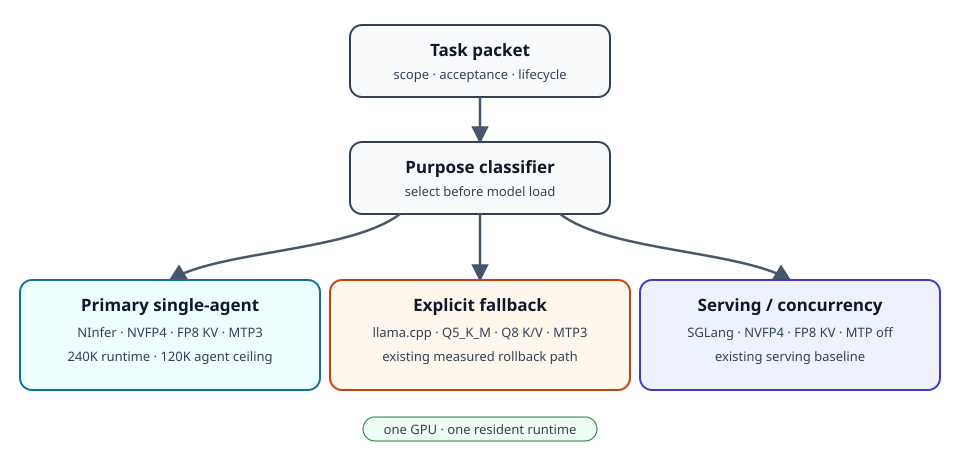
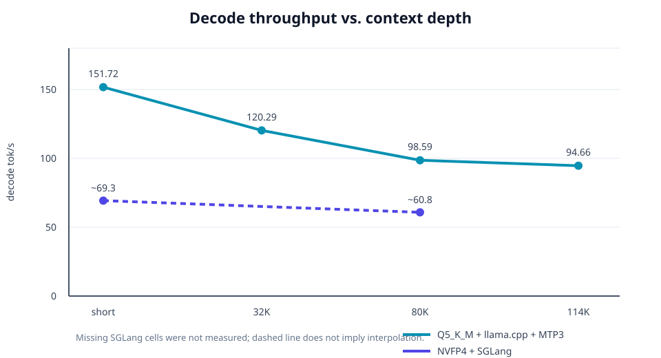

# Qwen3.8-27B on RTX 5090 — 128K Dual-Runtime Agent Recipe

> **151 tok/s did not beat 69 tok/s on the same autonomous coding task.** This was one counted long-task run, not a general claim about Q5 quantization or every agent workload.

**This repository does not contain modified model weights. It provides reproducible RTX 5090 inference configurations, benchmarks, and an agent-routing recipe for Qwen3.8-27B.**

[Hugging Face showcase](https://huggingface.co/spaces/kutaelee/Qwen3.8-27B-RTX5090-128K-Recipe) · [Benchmark results](benchmarks/runtime-comparison.md) · [Reproduction guide](docs/reproducibility.md) · [Publishing guide](docs/publishing.md)

## 1. Overview

This recipe runs Qwen3.8-27B at a 131,072-token server context on one 32 GB RTX 5090. It does not keep two models resident at once. A task router stops and cleans up the previous runtime, then starts exactly one of two loopback-only backends:

- **Long / autonomous / complex work:** `RadixArk/Qwen3.8-27B-NVFP4` on SGLang with FP8 E4M3 KV, FlashInfer, and MTP off.
- **Quick / bounded implementation:** `bartowski/Qwen3.8-27B-GGUF`, file `Qwen3.8-27B-Q5_K_M.gguf`, on llama.cpp with Q8_0 K/V and MTP3.

The central finding is not a top-line TPS record:

> **Raw decode TPS is not agent throughput.**

The Q5/MTP3 route decoded roughly 1.5–2× faster in runtime benchmarks and was accurate on bounded coding. In one counted autonomous web-project trajectory, it spent a full 32,768-token completion on an invalid oversized regular expression and did not reach a semantic edit before the slower SGLang baseline's entire wall time had elapsed.

## 2. Why two runtimes?

The two backends optimize different failure surfaces.

| Workload | Selected runtime | Reason |
| --- | --- | --- |
| `quick-code`, bounded edits, structured tool use | Q5_K_M + llama.cpp + MTP3 | High decode throughput, 10/10 single-file qualification, multi-file build/test pass |
| `complex-code`, `long-context`, analysis | NVFP4 + SGLang | Stable 80K+ context behavior and better observed long-horizon trajectory |
| `autonomous`, planning, integration | NVFP4 + SGLang | Completed the counted medium project without a read/test runaway, with disclosed acceptance caveats |

This is a **workload-aware routing result**, not a claim that either artifact is universally better.

## 3. Hardware

| Component | Tested system |
| --- | --- |
| GPU | NVIDIA GeForce RTX 5090, 32,607 MiB reported |
| Driver | 610.74 |
| Host | Windows with WSL2/Docker for SGLang; native Windows CUDA for llama.cpp |
| Concurrency | One generation runtime, one request, one GPU |

No model weights are stored in this repository. See [Upstream models/projects](#11-upstream-modelsprojects).

## 4. Runtime A — SGLang NVFP4

Tested configuration:

- Model: [`RadixArk/Qwen3.8-27B-NVFP4`](https://huggingface.co/RadixArk/Qwen3.8-27B-NVFP4), pinned tested revision [`52d1adc5…b854`](https://huggingface.co/RadixArk/Qwen3.8-27B-NVFP4/tree/52d1adc5f38aa5ebf099c29ed7025ba34cfbb854)
- SGLang package: `0.0.0.dev0+qwen38.27b.g561c8f3`
- Image build commit: [`c4271c3f…51c5`](https://github.com/sgl-project/sglang/commit/c4271c3fe1262fc2adbd162c33b25de5255251c5)
- Pinned container digest: `sha256:506525a5907ea22c9d445afb7c03603959b912de034d86915cf17da814f1a124`
- Server context: 131,072
- KV: FP8 E4M3; available pool approximately 148,997 tokens
- Attention: FlashInfer
- MTP/speculation: off
- `max-running-requests=1`, `max-mamba-cache-size=5`
- CPU layer offload: 0

Measured steady decode median was approximately **69.3 tok/s**; at 80K+ context it was approximately **60.8 tok/s**. See [`configs/sglang-nvfp4-128k.example.sh`](configs/sglang-nvfp4-128k.example.sh).

## 5. Runtime B — llama.cpp Q5 + MTP3

Tested configuration:

- Artifact repository: [`bartowski/Qwen3.8-27B-GGUF`](https://huggingface.co/bartowski/Qwen3.8-27B-GGUF), tested revision [`f0eec4a4…c034`](https://huggingface.co/bartowski/Qwen3.8-27B-GGUF/tree/f0eec4a4bb4975114a030d048952d83c0a53c034)
- File: `Qwen3.8-27B-Q5_K_M.gguf`
- File SHA-256: `E731E180460B906F373294A4E2DE10541E80EE676AF7F8C949A84DBB6ED3CAA8`
- llama.cpp build 10435, commit [`9e40df63…7e99`](https://github.com/ggml-org/llama.cpp/commit/9e40df63ba151d771d8b247ac4011cf203337e99)
- Server context: 131,072
- KV: Q8_0 K and Q8_0 V
- Flash Attention on; all 66/66 layers on GPU; CPU fallback 0
- `parallel=1`, `batch=2048`, `ubatch=512`, vision off
- MTP3: `--spec-type draft-mtp --spec-draft-n-max 3`

Peak qualification retained approximately **2.1 GiB free VRAM**. See [`configs/llamacpp-q5-mtp3-128k.example.ps1`](configs/llamacpp-q5-mtp3-128k.example.ps1).

## 6. Benchmark results

| Runtime | Short | 32K | 80K | 114K | Context | Use |
| --- | ---: | ---: | ---: | ---: | ---: | --- |
| SGLang NVFP4 | ~69.3 | — | ~60.8 | — | 128K | long agent |
| Q5 + MTP3 | 151.72 | 120.29 | 98.59 | 94.66 | 128K | bounded worker |

Missing cells were not measured under the same published suite and are intentionally left blank. These are server decode results, not end-to-end agent throughput. See [methodology](docs/methodology.md) and the machine-readable [`runtime-comparison.csv`](benchmarks/runtime-comparison.csv).

## 7. Agent qualification

| Runtime | Bounded coding | Long autonomous |
| --- | --- | --- |
| SGLang NVFP4 | Runtime/tool correctness passed | Medium web task completed in 526.388 s; build gates and major browser flows passed; final implementation gate failed on one unauthorized generated-file change and mobile Sheet focus restoration |
| Q5 + MTP3 | 10/10 TSX fixtures plus multi-file build/test 2/2 passed | Production promotion rejected: in one counted run, no semantic edit after at least 541 s; one 32,768-token completion generated an invalid oversized regex |

SGLang's counted project run used 86 tool calls and completed typecheck, lint, 8/8 tests, build, `git diff --check`, and major desktop/mobile flows in about 8m46s. It is reported as **completed with acceptance caveats**, not as a clean implementation PASS.

The Q5 long-agent result is explicitly **N=1**. It shows a bad trajectory can erase a raw TPS advantage; it does not establish an intrinsic limitation of Q5 quantization.

## 8. Routing strategy

The example router is data-only and intentionally small: [`configs/local-model-router.example.json`](configs/local-model-router.example.json). A production controller should:

1. Classify the bounded task before loading a model.
2. Stop only the runtime it owns and verify its port/VRAM were released.
3. Start the selected runtime through the machine's GPU scheduler.
4. Verify `/v1/models` returns the expected immutable model ID.
5. Run Qwen Code with task-local settings and thinking disabled.
6. Independently validate the diff and acceptance gates.

See [agent routing](docs/agent-routing.md) for failure handling and lifecycle boundaries.

## 9. Reproduction

1. Obtain model artifacts directly from the upstream repositories. Do not copy them into this repository.
2. Verify the exact revision and, for the tested GGUF, the file SHA-256 shown above.
3. Build or install the pinned runtimes.
4. Adapt the generic model/cache paths in `configs/`; retain loopback-only publishing.
5. Start only one backend.
6. Run `scripts/healthcheck.example.ps1` against `/v1/models`.
7. Run correctness before throughput, then bounded and long-agent suites separately.

Full steps and evidence requirements are in [reproducibility.md](docs/reproducibility.md).

## 10. Limitations

- The hardware sample is one RTX 5090 system.
- The long-agent comparison contains one counted trajectory per reported runtime condition; it is not a statistical model-quality benchmark.
- SGLang and Q5 measurements do not populate every identical context depth.
- The SGLang counted implementation had two concrete acceptance failures despite completing the project.
- The Q5 runtime passed correctness and bounded coding but is not promoted for autonomous work by this evidence.
- Driver, kernels, model revisions, runtime commits, and agent versions can materially change results.
- No vision path was tested in these recipes.

More detail: [limitations.md](docs/limitations.md).

## 11. Upstream models/projects

This project does not own, modify, sublicense, or redistribute the linked model weights.

- [`Qwen/Qwen3.8-27B`](https://huggingface.co/Qwen/Qwen3.8-27B) — base model, Apache-2.0 metadata
- [`RadixArk/Qwen3.8-27B-NVFP4`](https://huggingface.co/RadixArk/Qwen3.8-27B-NVFP4) — NVFP4 artifact, Apache-2.0 metadata
- [`bartowski/Qwen3.8-27B-GGUF`](https://huggingface.co/bartowski/Qwen3.8-27B-GGUF) — GGUF artifact, Apache-2.0 metadata
- [`ggml-org/llama.cpp`](https://github.com/ggml-org/llama.cpp) — MIT
- [`sgl-project/sglang`](https://github.com/sgl-project/sglang) — Apache-2.0
- [`QwenLM/qwen-code`](https://github.com/QwenLM/qwen-code) — Apache-2.0

Always review the license and model card at the exact revision you download. The repository license does not replace upstream model or runtime licenses.

The exact revisions and license sources checked for this release are recorded in [upstream-licenses.md](docs/upstream-licenses.md).

## 12. License / acknowledgements

The original recipe, documentation, small validation scripts, and diagrams in this repository are MIT licensed. Model artifacts and upstream runtimes retain their respective licenses. Thanks to the Qwen, RadixArk, bartowski, llama.cpp, SGLang, and Qwen Code maintainers and contributors.
